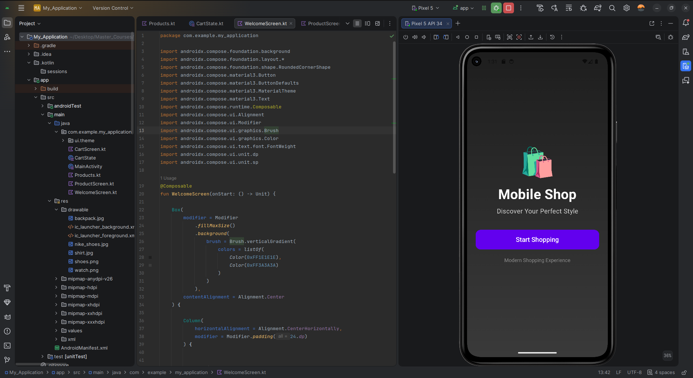
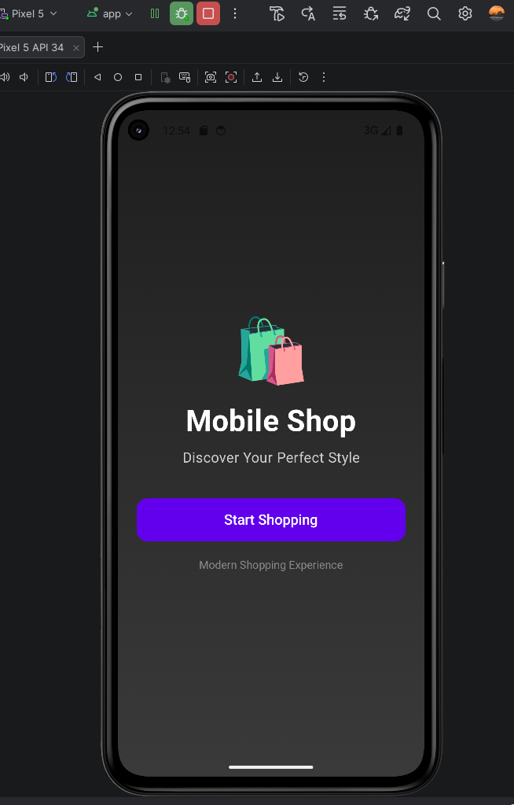
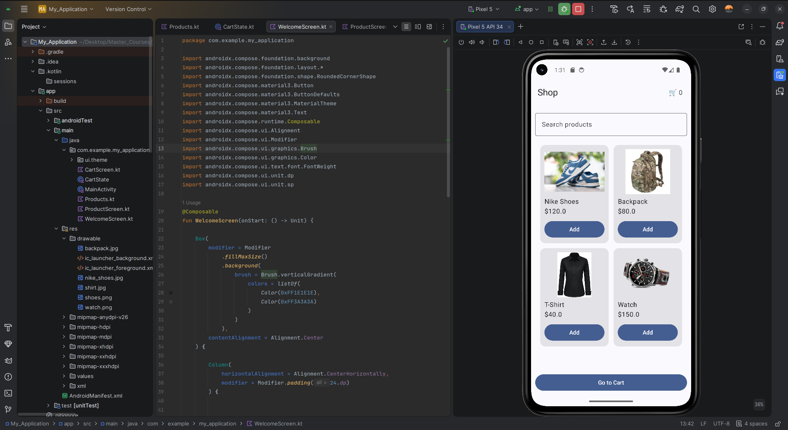
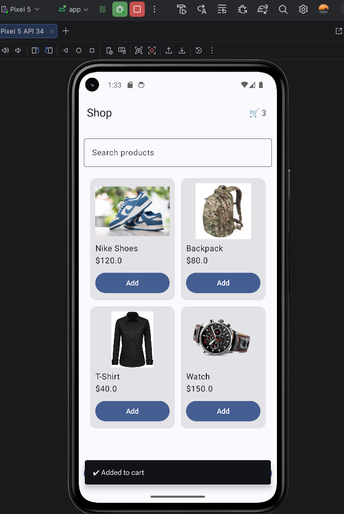
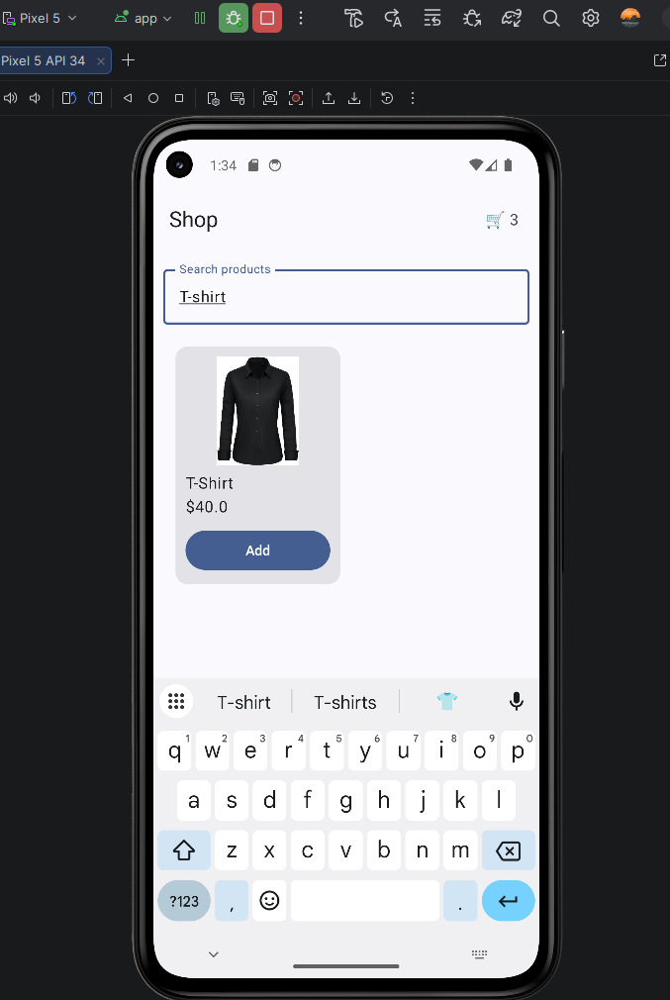
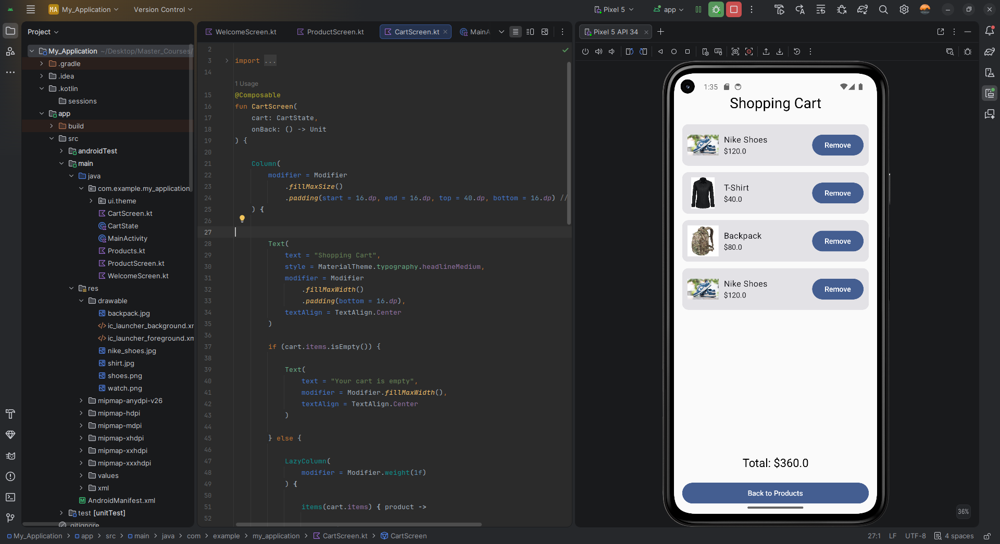
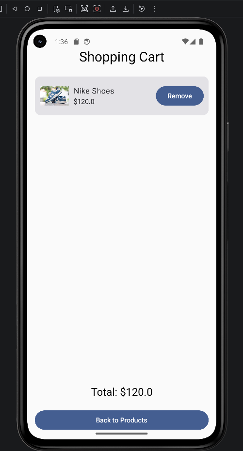
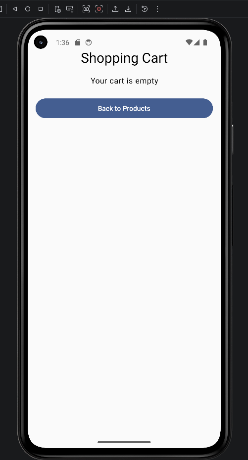

# 🛍️ Mobile Shop App (Jetpack Compose)

📱 A modern Android shopping app built with Kotlin Jetpack Compose featuring product browsing, cart system, and real-time total calculation.

---

## 👤 Student Information

- **Name:** Ahmed Omar Ali  
- **Course:** Mobile Programming  
- **Assignment:** Exercise 1 – Mobile Shop App  

---

## 📌 Project Description

This project is a Mobile Shop Android application developed using Kotlin Jetpack Compose in Android Studio.

The app simulates a real shopping experience where users can:
- Browse products
- Search items
- Add products to cart
- Remove items from cart
- View total price in real time

The application uses a modern Material3 UI design with a responsive layout and smooth navigation between screens:
**Welcome → Products → Cart**

---

## ⭐ Key Highlights

- Modern Jetpack Compose UI  
- Welcome screen with smooth navigation  
- Product grid layout with images  
- Search functionality  
- Add/remove cart system  
- Real-time total calculation  
- Snackbar feedback messages  
- Empty cart handling  

---

## ✨ Features

### 🟢 Welcome Screen
- First screen shown when app starts  
- Modern styled UI  
- Start Shopping button  

### 🛍 Product Screen
- Displays products in grid layout  
- Shows images, names, and prices  
- Search bar for filtering products  
- Add to cart button with confirmation  

### 🛒 Cart Screen
- Displays selected items  
- Shows product image and details  
- Remove items from cart  
- Calculates total price automatically  
- Handles empty cart state  

---

## 🧰 Technologies Used

- Kotlin  
- Jetpack Compose  
- Material3  
- Android Studio  
- Android Emulator  

---

## 📁 Project Structure

MainActivity.kt → Handles navigation between screens and app state
WelcomeScreen.kt → Welcome UI screen shown at app launch
ProductScreen.kt → Displays products with search and add-to-cart
CartScreen.kt → Shows cart items and total price
Product.kt → Data model for products (id, name, price, image)
CartState.kt → Manages cart logic (add, remove, total)
res/drawable/ → Stores product images used in the app

---

## 🚀 How to Configure and Run Your Solution to This Challenge

Follow these steps carefully to run the project:

1. Open **Android Studio**
2. Click **Open Project**
3. Select the project folder (Mobile Shop App)
4. Wait for **Gradle synchronization** to complete
5. Ensure all dependencies are downloaded successfully
6. Start an **Android Emulator** or connect a physical Android device
7. Click the **Run ▶ button**
8. The application will launch and start with the **Welcome Screen**
9. Click **Start Shopping** to continue to the product screen

---

## 📸 Screenshots

### 🟢 Welcome Screen
  

---

### 🛍 Product Screen
  

---

### 🔍 Search Feature

---

### 🛒 Cart Screen
  

---

### ⚠️ Empty Cart State

---

## 🌐 GitHub Repository

Full source code available here:

👉 https://github.com/AhmedymHub/Mobile-Shop-Compose

---

## 🎯 Conclusion

This project demonstrates a complete Mobile Shop application built using Kotlin Jetpack Compose. It includes modern UI design, navigation system, product browsing, search functionality, cart management, and real-time price calculation.

The application fulfills all assignment requirements including:
- Functional Android app
- UI design and responsiveness
- Screenshots documentation
- Project structure explanation
- Setup and run instructions

---

## 🏁 End of Project
